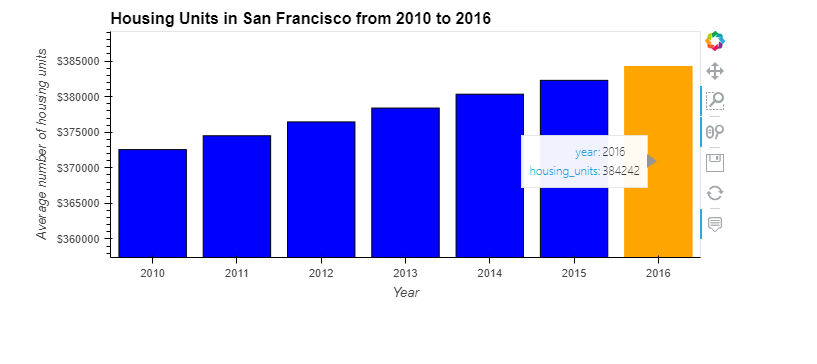
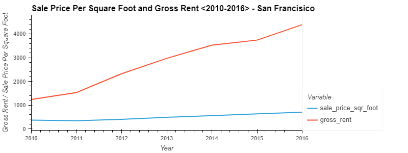
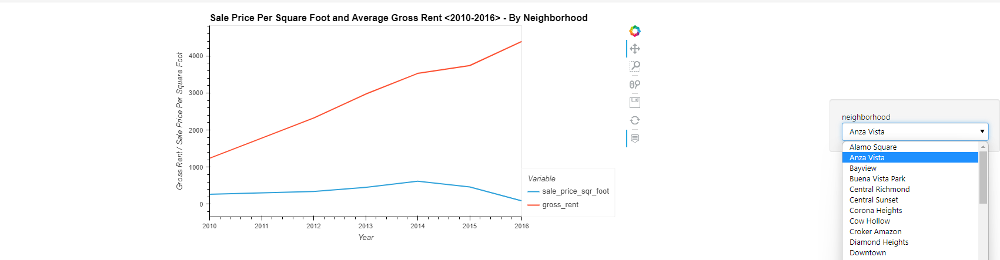
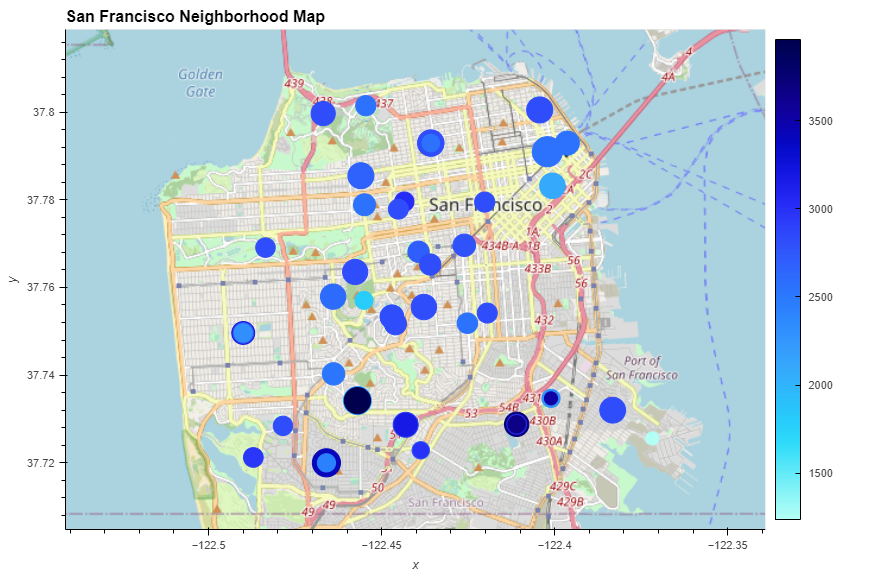

# Unit-6-Housing-Rental-Analysis-for-San-Francisco

The project is to give investors an overview of understanding San Francisco Neighborhoods housing market trends. By navigating interactive charts will help investors to find areas in the San Francisco market that are viable investment opportunities.

---

### Step 1

Visualize long term San Francisco housing market supply from 2010 to 2016.
Click the [Housing Units By Year](Images/housing_units_by_year_chart.html) , move cursor to see detailed numbers.

---

### Step 2

Visualize San Francisco historical [Rental and Sale Price - San Francisco ](Images/prices_square_foot_by_year_chart.html), move cursor to see average average Sale Price Per Square Foot and Gross Income.

---
### Step 3
Visualize San Francisco historical [Rental and Sale Price - By Neighborhoods ](Images/prices_by_year_by_neighborhood_chart.html), from the drop-down bar on right hand select `neighborhood`  to see detailed individual neighborhood performance.

---
### Final Step

From our one-click  [San Francisco Neighborhood Map](Images/all_neighborhoods_df_chart.html) below
, you will quickly visualize areas with **darker blue and smaller circles**, meaning **higher rental income, lower sale pric**, this will help you to search the desired neighborhoods to implement buy-and-rent strategy. 

At the same time, you are able to avoid areas with **big circles and light blue**, meaning **higher sale price, lower rental income**,which are indicating lower investment return.

---

